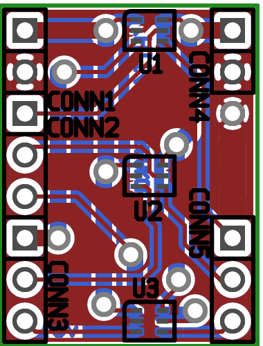

74LVCH1T45 x3 Breakout
======================

This is a design for a very simple DIP breakout for three 74LVCH1T45
level shifters in tiny SOT363 packages. These devices are bidirectional
level shifters which allow for the Vdd on either side to be higher than
the other, even in the same application, making them useful for
communicating with external circuits that might have higher or lower
voltages. The `H` in the model number indicates an active bus hold
feature that makes external pull-up/down unnecessary.

The important parts of the board are these:

*   Each of Vdd A, Vdd B, and GND are bussed among all three devices.
*   The pins are arranged so that related A and B pins are situated on
    opposite sides of the board.
    *   Broken out on the left side, in this order:
        *   Vdd A and GND
        *   DIR pins for each of the devices
        *   I/O A for each of the devices

    *   Broken out on the right side, in this order:
        *   Vdd B and GND
        *   (Blank spaces across from the DIR pins)
        *   I/O B for each of the devices

*   The far side of the board is kept fairly simple and laid out with
    larger traces to allow some room for misalignment with the near
    side.
*   Vias are situated apart from devices (i.e., not underneath anything)
    and are suitably large to solder wires through by hand.
*   The pins are not assumed to be plated-through vias, so they need
    only be soldered on the near side.
    *   In particular, the ground planes are connected together using a
        separate via rather than requiring either of the ground pins to
        be soldered on both sides. However, the pins do remain laid out
        as thermals, giving the option of soldering on both sides and
        leaving out the additional via.

As of this writing, I haven't fabricated this board yet. As mentioned
above, it includes minor design considerations to make it slightly
easier to produce by hand using conventional homebrew. I can't give any
guarantee or even any indication that it is suitable for proper
manufacturing in its present state. (I don't intend to have it made for
me since, like just about any breakout, its primary purpose is to make a
device breadboardable so I can determine that it works as expected in a
larger design—and then have *that* design fabbed instead.)

License
-------

The schematic and layout are to be used under the terms of the
OSI-approved MIT license, wherein the "Software" refers to these files.
The text follows:

> Copyright © 2014 Peter S. May
>
> Permission is hereby granted, free of charge, to any person obtaining
> a copy of this software and associated documentation files (the
> "Software"), to deal in the Software without restriction, including
> without limitation the rights to use, copy, modify, merge, publish,
> distribute, sublicense, and/or sell copies of the Software, and to
> permit persons to whom the Software is furnished to do so, subject to
> the following conditions:
>
> The above copyright notice and this permission notice shall be
> included in all copies or substantial portions of the Software.
>
> THE SOFTWARE IS PROVIDED "AS IS", WITHOUT WARRANTY OF ANY KIND,
> EXPRESS OR IMPLIED, INCLUDING BUT NOT LIMITED TO THE WARRANTIES OF
> MERCHANTABILITY, FITNESS FOR A PARTICULAR PURPOSE AND NONINFRINGEMENT.
> IN NO EVENT SHALL THE AUTHORS OR COPYRIGHT HOLDERS BE LIABLE FOR ANY
> CLAIM, DAMAGES OR OTHER LIABILITY, WHETHER IN AN ACTION OF CONTRACT,
> TORT OR OTHERWISE, ARISING FROM, OUT OF OR IN CONNECTION WITH THE
> SOFTWARE OR THE USE OR OTHER DEALINGS IN THE SOFTWARE.
